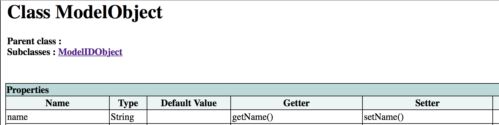
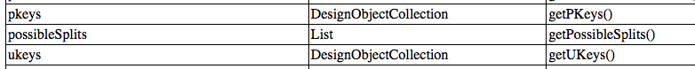
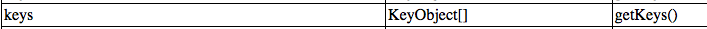
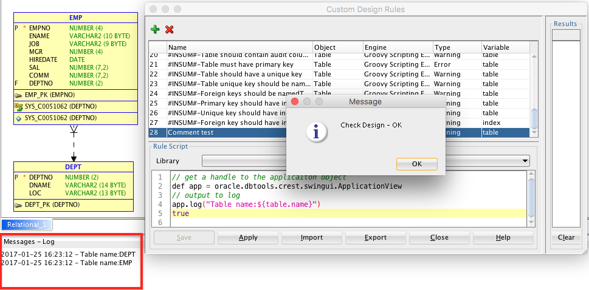
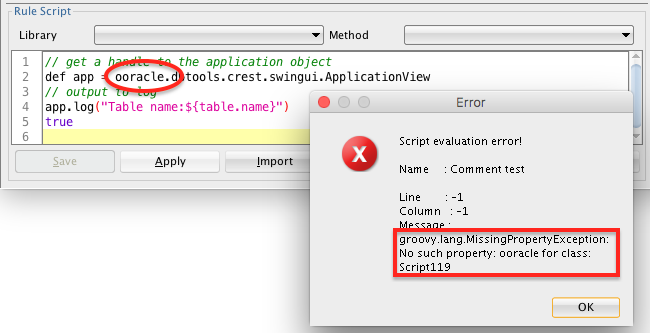

## Groovy Goodness
1. Groovy comments are designated using `// comment` or `/* comment */`.
2. Groovy syntax has similarities to Java, JavaScript and other scripting languages.
3. Using Groovy, properties that are accessed using getters and setters, can be retrieved and set by simply referencing the property name. For example, as seen below, the ultimate parent of the Table object, has a name property. Assuming that you are writing a rule to be run against a table, you can get the name property thusly: `table.name`.
 

4. As mentioned earlier, some properties are actually collections. For example, as seen in the `index.html` file, the unique and primary keys of a table are referenced as a collection. Please note that a `DesignObject` is the parent class for many types of objects. In this case, the entire collection can be referenced directly from the table object like this: `table.UKeys`.
 

 However, some of these groups are returned as an array of objects, such as all the indexes on a table being an array of `KeyObjects`, the parent class of an `Index` object.
 

 In this case, the method call must be used to retrieve the array: `table.getKeys()`.

5. The collections used in the SDDM model are Java List objects. Groovy lists are easy to work with and have many helper methods, some handy ones are described [here](http://grails.asia/groovy-list-tutorial-and-examples).

6. Groovy has  full support for regular expressions. The use of the extremely handy matcher operator is detailed [here](http://mrhaki.blogspot.com/2009/09/groovy-goodness-matchers-for-regular.html).

7. Groovy strings can be denoted with either single or double quotes. String elements can be accessed using a 0-based array. The last member of a string can be retrieved using an index of -1, the second-last using -2 and so on. There are a multitude of convenience methods on strings. A good listing can be found [here](https://www.tutorialspoint.com/groovy/groovy_strings.htm).
8. Debugging can be tricky, but you can send messages to the application log like this:
```groovy
// get a handle to the application object
def app = oracle.dbtools.crest.swingui.ApplicationView
// output to log
app.log("Table name:${table.name}")
```
Or, if you are using SDDM^Plus, you can use the *log()* method like this:
```groovy
// output to log using sddm-plus
log("Table name:${table.name}")
```
Click on **Apply**, and the output appears in the **Messages - Log** pane. If the Log pane is not visible, select **View | Log** from the top-level menu.

 

9. Script errors will appear in a separate **Error** dialog popup.

 

10. To write to a file, follow this example which outputs the table and column names for each table:


 ```groovy
def txtFile = "Desktop/test.txt"
def file = new File(txtFile)
file << "Table: ${table.name}\n"
table.elements.each { col ->
  file << "  col: ${col.name}\n"
}
return true
```
