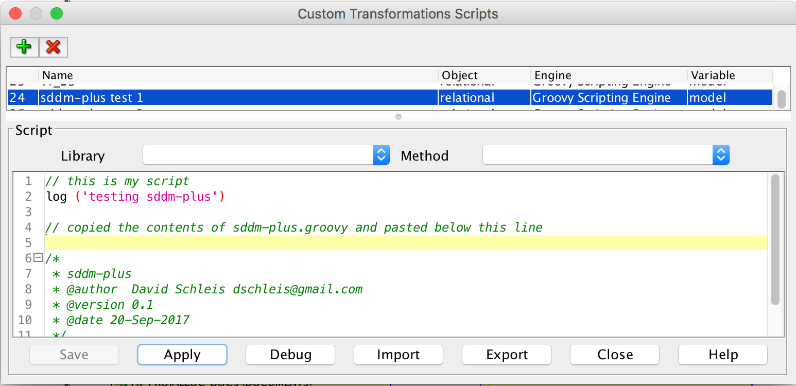
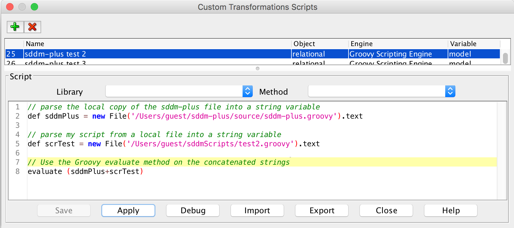
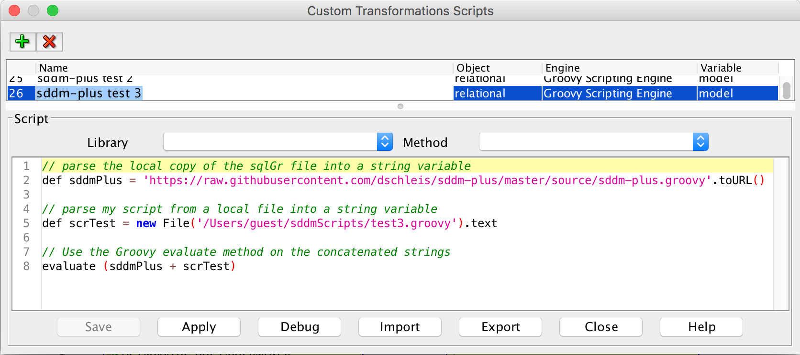

## Using SDDM^Plus

To take advantage of the SDDM^Plus  methods, the contents of sddm-plus.groovy must be included in the script that is run from within Data Modeler in some way.

You can include sddm-plus.groovy can by:
1. Appending the contents of sqlGr to your script

2. Concatenating your external script with a local copy of sddm-plus.groovy.

3. Concatenating your external script with the reference version of sddm-plus.groovy. This takes a bit longer to run, but you are guaranteed to have the latest version of the script helpers.

